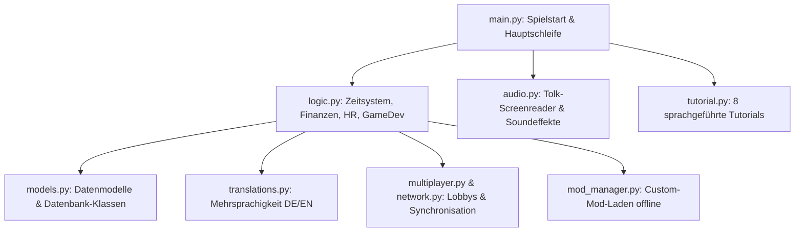

# 🚀 Entwickler-Onboarding & Projekt-Briefing: Audio Studio Tycoon (v3.11.0-beta.1)

> [!IMPORTANT]
> **DIESES DOKUMENT IST DER ALLES-ENTSCHEIDENDE EINSTIEG FÜR DEN NÄCHSTEN KI-AGENTEN.**
> Falls der Benutzer das "Brain" (Kontext) bereinigt und diese Unterhaltung gelöscht hat, kopiere den untenstehenden **Starter-Prompt** als deine allererste Nachricht, um das Projekt nahtlos fortzuführen.

---

## 🇩🇪 STARTER-PROMPT FÜR DEN NÄCHSTEN AGENTEN (Bitte kopieren!)

```text
Hallo! Ich bin ein KI-Entwickler und möchte an dem Projekt "Audio Studio Tycoon" weiterarbeiten. Ich habe den gesamten Kontext aus der Datei `NEXT_AGENT_ONBOARDING.md` im Projektverzeichnis gelesen. Ich weiß, dass es sich um ein 100 % barrierefreie, screenreader-optimiertes Studio-Management-Tycoon-Spiel (Python) in Deutsch und Englisch handelt.

Aktueller Stand ist v3.11.0-beta.1 (vollständig stabil, Übersetzungsparität bei 100 %, alle vier neuen Major-Features: Hardware-Labor & Soundkarten, Fanpost-Community-Center, Mitarbeiter-Persönlichkeiten, Marketing-Jingle-Generator mit Bumper-Sounds voll implementiert und erfolgreich getestet). Alle meine Antworten und Interaktionen müssen streng auf DEUTSCH erfolgen (gemäß RULE[user_global]). 

Ich bin bereit für die nächsten Schritte! Bitte analysiere den Projektordner und lass uns besprechen, wie wir fortfahren möchten:
Option A: Offizielles Release von Version 3.11.0 (Stable) mit PyInstaller-Kompilierung, ZIP-Archivierung und GitHub-Tagging.
Option B: Entwicklung eines neuen Major-Features für v3.12.0-beta.1.

Welche Option oder welches Feature möchtest du als erstes angehen?
```

---

## 🎮 Über das Spiel (Audio Studio Tycoon)

**Audio Studio Tycoon** ist eine Wirtschaftssimulation, in der der Spieler ab dem Jahr 1930 ein Audio-Spielestudio gründet, Spiele entwickelt, Mitarbeiter einstellt, vermarktet, forscht und expandiert.
Das entscheidende Alleinstellungsmerkmal: **Es ist von Grund auf für blinde und sehbehinderte Spieler konzipiert und optimiert (100% Accessible-First).**

### ♿ Barrierefreiheits-Design & Regeln
1. **Screenreader-Integration:** Die Sprachausgabe erfolgt über die Bibliothek `Tolk` (in `audio.py`), die installierte Screenreader (wie NVDA oder JAWS) automatisch erkennt und anspricht. Steht kein Screenreader zur Verfügung, erfolgt ein Fallback auf das Microsoft SAPI-Sprachsystem (TTS).
2. **Keine visuellen Hindernisse:** Keine ANSI-Farbcodes, keine ASCII-Art-Rahmen und keine UI-Tabellen, die Screenreader irritieren könnten. Die UI besteht aus klaren, linear navigierbaren Menüs.
3. **Akustisches Feedback (Bumper-Sounds):** Wenn ein Spieler in einem Menü an das obere oder untere Ende gelangt, ertönt ein kurzer, markanter Boundary-Sound (Bump-Ton).
4. **Steuerung:** Ausschließlich über Tastatur (Pfeiltasten zur Navigation, Pfeiltasten Links/Rechts zum Einstellen von Slidern, Enter zum Bestätigen, Backspace/Esc zum Zurückgehen, dedizierte Hotkeys für Statusberichte).

---

## 📁 Code-Architektur & Dateistruktur

Hier ist die genaue Aufteilung der Quellcode-Dateien in `scratch/Audio_Studio_Tycoon/`:



### Die Hauptdateien und ihre Aufgaben:

* **[main.py](file:///C:/Users/lauri/.gemini/antigravity/scratch/Audio_Studio_Tycoon/main.py):** Der Einstiegspunkt des Spiels. Initialisiert den Screenreader, steuert den Haupt-Game-Loop, fängt Tastatureingaben ab und regelt die Menüführung.
* **[logic.py](file:///C:/Users/lauri/.gemini/antigravity/scratch/Audio_Studio_Tycoon/logic.py):** Das Gehirn des Spiels. Berechnet wöchentliche Updates, Gehälter, Steuern, Kreditzinsen, die Spielentwicklung (Slider, Punkte, Hype-Aufbau) und die Bewertungen der Presse.
* **[models.py](file:///C:/Users/lauri/.gemini/antigravity/scratch/Audio_Studio_Tycoon/models.py):** Enthält alle Datenklassen wie `Studio`, `Employee`, `Game`, `ResearchProject` und `Platform`.
* **[audio.py](file:///C:/Users/lauri/.gemini/antigravity/scratch/Audio_Studio_Tycoon/audio.py):** Verwaltet die Sprachausgabe (Speech Queue) und die Soundeffekte. Enthält eine Windows-spezifische UTF-8/ASCII Fallback-Logik, damit die Windows-Konsole bei Emojis oder Umlauten in CP1252 niemals abstürzt.
* **[translations.py](file:///C:/Users/lauri/.gemini/antigravity/scratch/Audio_Studio_Tycoon/translations.py):** Enthält die gesamten Übersetzungs-Wörterbücher für Deutsch (`de`) und Englisch (`en`). 100 % symmetrisch aufgebaut.
* **[tutorial.py](file:///C:/Users/lauri/.gemini/antigravity/scratch/Audio_Studio_Tycoon/tutorial.py):** Regelt die 8 interaktiven, sprachgeführten Einführungen.
* **[multiplayer.py](file:///C:/Users/lauri/.gemini/antigravity/scratch/Audio_Studio_Tycoon/multiplayer.py) & [network.py](file:///C:/Users/lauri/.gemini/antigravity/scratch/Audio_Studio_Tycoon/network.py):** Realisieren den Mehrspielermodus über WebSockets, inklusive sicherer Verbindungsbereinigung (`disconnect()`).
* **[mod_manager.py](file:///C:/Users/lauri/.gemini/antigravity/scratch/Audio_Studio_Tycoon/mod_manager.py):** Lädt Offline-Modifikationen aus dem Ordner `mods/`.

---

## 🧱 Kern-Systeme & Datenflüsse

### 1. Dynamisches Zeitsystem
Alle Berechnungen basieren auf der zentralen Konstante `WEEKS_PER_YEAR` in [logic.py](file:///C:/Users/lauri/.gemini/antigravity/scratch/Audio_Studio_Tycoon/logic.py).
* **Wöchentlicher Loop:** Jede Spielwoche werden Steuern, Serverabos und Kredite berechnet.
* **Gehaltslauf:** Findet dynamisch alle `WEEKS_PER_YEAR // 12` Wochen (monatlich) statt. Mitarbeitergehälter und Büromieten werden hier abgebucht.
* **Saisonale Events:** Jedes Quartal gibt es saisonale Boni/Malusse für Marketing und Genre-Verkäufe.

### 2. Audio- & Sprach-Warteschlange
Die Sprachausgabe in [audio.py](file:///C:/Users/lauri/.gemini/antigravity/scratch/Audio_Studio_Tycoon/audio.py) arbeitet asynchron:
* `say(text)` fügt Text zur Warteschlange hinzu (wird nacheinander gesprochen).
* `say_interrupt(text)` stoppt die aktuelle Ausgabe sofort und spricht den neuen Text (wichtig für schnelle Menü-Navigation).
* `play_sound(sound_name)` spielt wav-Dateien (z.B. den "Bump"-Grenzsound) ab.

### 3. Symmetrische Lokalisierung
Die Datei [translations.py](file:///C:/Users/lauri/.gemini/antigravity/scratch/Audio_Studio_Tycoon/translations.py) hält Übersetzungen synchron.
* **Strict Parity Rule:** Jeder Schlüssel (Key) in der Sektion `de` **muss** exakt so auch in der Sektion `en` existieren (und umgekehrt).
* Ein automatisiertes Audit-Skript [compare_translations.py](file:///C:/Users/lauri/.gemini/antigravity/scratch/Audio_Studio_Tycoon/compare_translations.py) verifiziert diese Parität bei jedem Release.

---

## 🎓 Das interaktive Tutorial-System

Es gibt **8 sprachgeführte Tutorials**, die dem Spieler die Mechaniken Schritt für Schritt beibringen:
1. **Willkommen & Steuerung (Welcome)**: Einführung in Tastenbelegungen und Pausenmodus.
2. **Büro & Zeitverlauf (Office)**: Wie die Zeit vergeht und Hotkeys (`S` für Status, `F` für Finanzen).
3. **Spielentwicklung (GameDev)**: Konzepte, Plattform-Lizenzierung und Slider-Optimierung.
4. **Forschung (Research)**: Freischalten neuer Genres, Themen und Custom-Engines.
5. **Personal (HR)**: Einstellen, Ausbilden und Aufrechterhalten der Arbeitsmoral.
6. **Marketing & Hype (Marketing)**: Werbekampagnen und Community-Pflege.
7. **Finanzen & Bank (Finance)**: Kredite aufnehmen, tilgen und Firmenübernahmen.
8. **Mehrspielermodus (Multiplayer)**: Lobby-Erstellung und synchronisiertes Entwickeln.

### 🧪 QA & Testabdeckung
Das Tutorial-System wird über das automatisierte Testskript [test_tutorials.py](file:///C:/Users/lauri/.gemini/antigravity/scratch/Audio_Studio_Tycoon/test_tutorials.py) umfassend simuliert. Bei Ausführung werden alle 8 Tutorials in beiden Sprachen gestartet, Eingaben emuliert und die korrekte Wiedergabe aller Audioschlüssel überprüft.
* **Befehl zum Testen:** `python test_tutorials.py` im AST-Verzeichnis.
* **Ergebnis:** `100 % OK (ALL TESTS PASSED)`.

---

## 🛠️ Release- & Build-Prozess

Das Spiel wird als eigenständige Windows-Anwendung kompiliert. 

### Eisernes Benennungs-Format (MANDATORY):
* **Executable:** `Audio_Studio_Tycoon_v[Version].exe`
* **Archiv:** `Audio_Studio_Tycoon_v[Version].zip`
* *Beispiel:* `Audio_Studio_Tycoon_v3.9.0.zip`

### Build-Schritte:
1. Aktualisiere die Versionsnummer in `version.json` und im `README.md`.
2. Starte [build_game.bat](file:///C:/Users/lauri/.gemini/antigravity/scratch/Audio_Studio_Tycoon/build_game.bat). Dieses Skript nutzt **PyInstaller** mit der passenden `.spec`-Datei, um die portable `.exe` zu bauen.
3. Führe [create_release.py](file:///C:/Users/lauri/.gemini/antigravity/scratch/Audio_Studio_Tycoon/create_release.py) aus, welches die `.exe`, DLLs (`Tolk.dll`, `nvdaControllerClient64.dll`), Assets und Übersetzungen in ein ZIP-Archiv verpackt.
4. Pushe das ZIP-Archiv und den Tag auf GitHub.

---

## 🔮 Roadmap & Zukünftige Optionen

Das System läuft absolut fehlerfrei auf Version `3.11.0-beta.1`. Folgende Optionen stehen bereit:

### 🌟 Option A: Veröffentlichung von Version 3.11.0 (Stable Release)
Schließe den aktuellen Beta-Zyklus ab:
1. Benenne alle Versionsreferenzen von `3.11.0-beta.1` auf `3.11.0` um.
2. Führe den Build-Prozess aus (`build_game.bat` & `create_release.py`).
3. Verpacke das finale ZIP als `Audio_Studio_Tycoon_v3.11.0.zip`.
4. Mache einen Git-Commit, erstelle den Git-Tag `v3.11.0` und pushe es auf GitHub.

### 🎪 Option B: Ein neues Major-Feature implementieren (für v3.12.0-beta.1)
* z.B. B1: Fortgeschrittenes Publisher-System, B2: E-Sports Sponsoring, B3: Erweiterte Multiplayer-Charts.

---

## ⚠️ Wichtige Entwicklungs-Regeln für dich (KI-Agent)
* **Sprache:** Alle Interaktionen mit dem Benutzer müssen in **GERMAN** verfasst sein!
* **Barrierefreiheit:** Verändere niemals den Audio-Kern (`audio.py`) ohne Rücksprache. Nutze immer `audio.say()` und `audio.play_sound()`.
* **Testing:** Teste Änderungen am Zeitsystem mit `test_time_system.py`, am Spielfluss mit `test_game_flow.py` und an den Tutorials mit `test_tutorials.py`.
* **GitHub:** Pushe deine Code-Änderungen nach getaner Arbeit immer automatisch in das Git-Repository!

Viel Erfolg bei der Weiterentwicklung von Audio Studio Tycoon! 🚀
